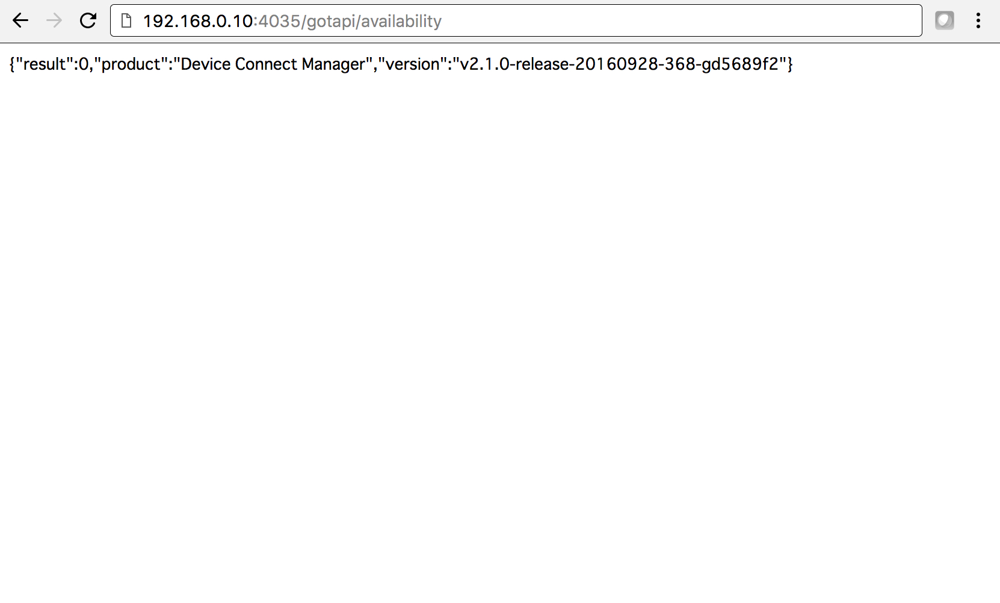
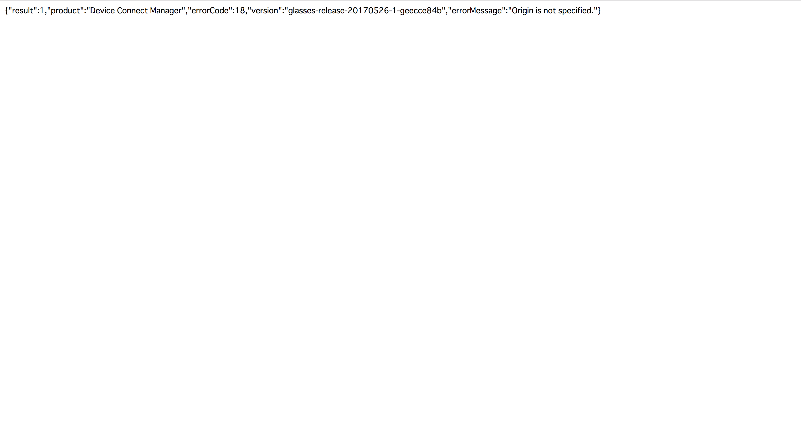

# 2.2 DeviceWebAPI Managerの生存確認

T3VXdTadj0c

## IPアドレスの確認

設定>設定の項目のHostとPort番号をメモしておきます。

## DeviceWebAPI Managerの生存確認

> http://192.168.0.10:4035/gotapi/availability

### 接続ができた場合

### どこか設定が間違っている場合

