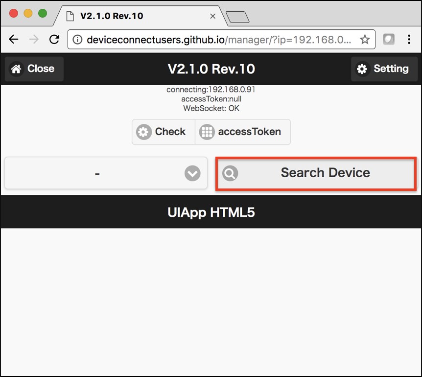
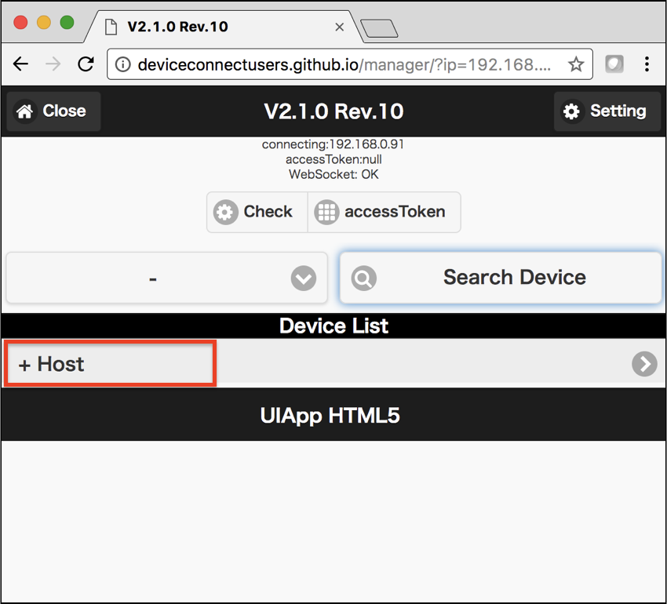
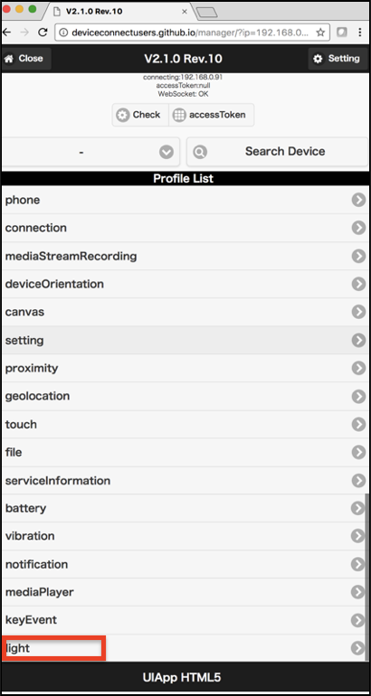
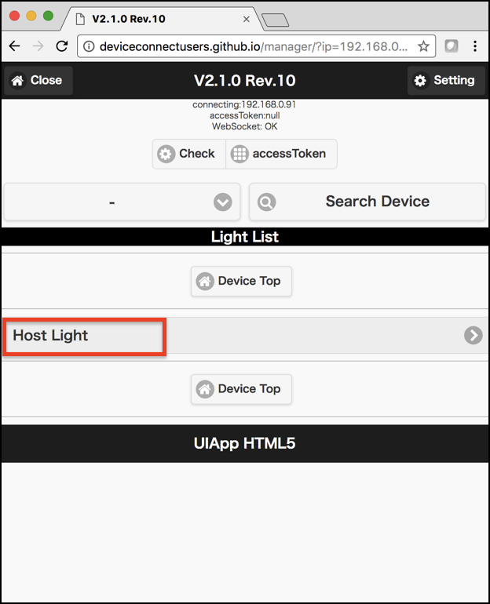
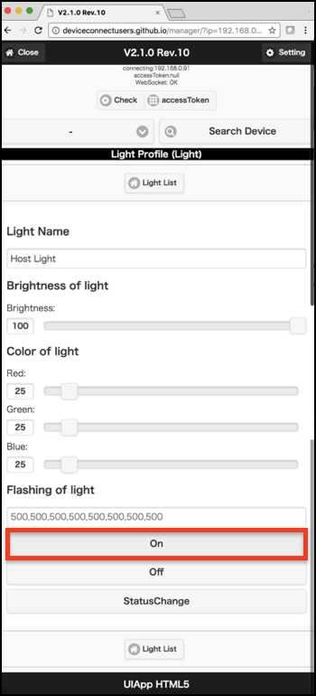

# 203.DEMOアプリで動作確認

a9XCYeleZGc

[http://deviceconnectusers.github.io/manager/](http://deviceconnectusers.github.io/manager/)にデモAppがあります。

[202.DeviceWebAPI Managerの生存確認](202_available.md)でメモしたIPアドレスを、URLの一番最後に、`?ip=メモしたIPアドレス`の形式で追加し、アクセスします。

今回は，アプリの例として，スマートフォンに搭載されているライトを点灯させるアプリを起動してみます。

## スマートフォンのライトを点灯させる
スマートフォンに搭載されているライトを点灯させるアプリです。

トップ画面のLaunch UI-App(HTML5)をクリックします。

次に，Search Devicesをクリックします。

そして，Hostをクリックします。

アプリ一覧が表示されるので，今回はスマートフォンのライトを点灯させる light を選択します。

Host Lightを選択します。

このような画面が出て来るので，実際に点灯させます。
点灯させるためには，下の On ボタンを押すことで，スマートフォンのライトが点灯します。

#### 点灯させた際の例

また，ライトを消灯するためには，On のボタンの下にあるOff ボタンでライトを消灯できます。 スライダなどをいじることによって，光量や色を変更することも可能です。
