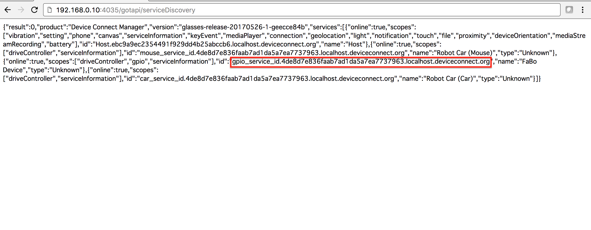
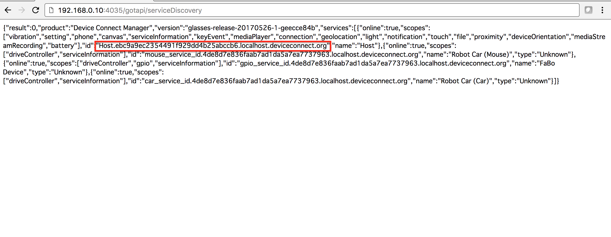
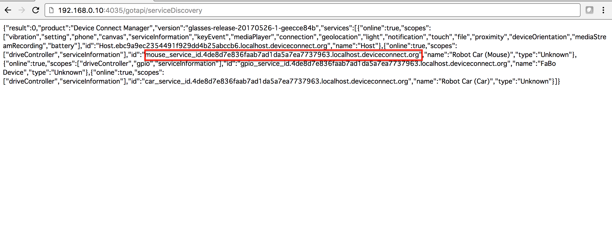

# 2.4 setting.jsの設定

## 本項目で使用するページ

|Web名|URL|
|:--|:--|
| sample.zip | http://www.fabo.io/deviceconnect/js/sample.zip |
| JSON FORMATTER & VALIDATOR | https://jsonformatter.curiousconcept.com/ |

## 設定する項目

[http://www.fabo.io/deviceconnect/js/sample.zip](sample.zip)をダウンロードし、解凍します。


sample/lib/setting.jsをSublime textで開き、設定値を自分の環境に書き直します。

```javascript
var ip = "192.168.0.46";
var port = "4035";
var gpioId = "gpio_service_id.4de8d7e836faab7ad1da5a7ea7737963.localhost.deviceconnect.org";
var hostId = "Host.ebc9a9ec2354491f929dd4b25abccb6.localhost.deviceconnect.org";
var mouseId = "mouse_service_id.4de8d7e836faab7ad1da5a7ea7737963.localhost.deviceconnect.org";
```

|Web名|URL|
|:--|:--|
|ip| DeviceWebAPI Managerが起動しているデバイスのIPアドレス(`IPとPortの確認`の項目で取得方法は解説)|
|port|DeviceWebAPI Managerのport番号(`IPとPortの確認`の項目で取得方法は解説)|
|gpioId| Gpio Device PluginのServiceId(`SeviceIdの取得`の項目で取得方法は解説) |
|hostId| Host Device PluginのServiceId(`SeviceIdの取得`の項目で取得方法は解説) |
|mouseId| Robot Mouse Device Plugin ServiceId(`SeviceIdの取得`の項目で取得方法は解説) |

の5つになります。

## IPとPortの確認


[全プラグインを再起動する]項目の下に表示されているのが、IPアドレスとPort番号になります。
これをメモしておきます。

## SeviceIdの取得

DeviceWebAPIでは、各プラグインにアクセスするためにServiceIdが必要となります。
ServiceIdの一覧は、/gotapi/serviceDiscoveryで取得する事が可能です。

> http://メモしたIP:メモしたPort/gotapi/serviceDiscovery







今回、FaBo PluginとHost PluginのServiceIdを取得します。
GPIO Pluginは、gpio_service_id.######で始まるIDです。Host Pluginは、Host.####で始まるIDになります。

> {"online":true,"scopes":["vibration","settings","phone","canvas","serviceInformation","keyEvent","mediaPlayer","connect","geolocation","light","notification","touch","file","proximity","deviceOrientation","fileDescriptor","mediaStreamRecording","battery"],"id":"Host.ebc9a9ec2354491f929dd4b25abccb6.localhost.deviceconnect.org","name":"Host"}

> {"online":true,"scopes":["driveController","gpio","serviceInformation"],"id":"gpio_service_id.4de8d7e836faab7ad1da5a7ea7737963.localhost.deviceconnect.org","name":"FaBo Device","type":"Unknown"}

> {"online":true,"scopes":["driveController","serviceInformation"],"id":"mouse_service_id.4de8d7e836faab7ad1da5a7ea7737963.localhost.deviceconnect.org","name":"Robot Car (Mouse)","type":"Unknown"}

