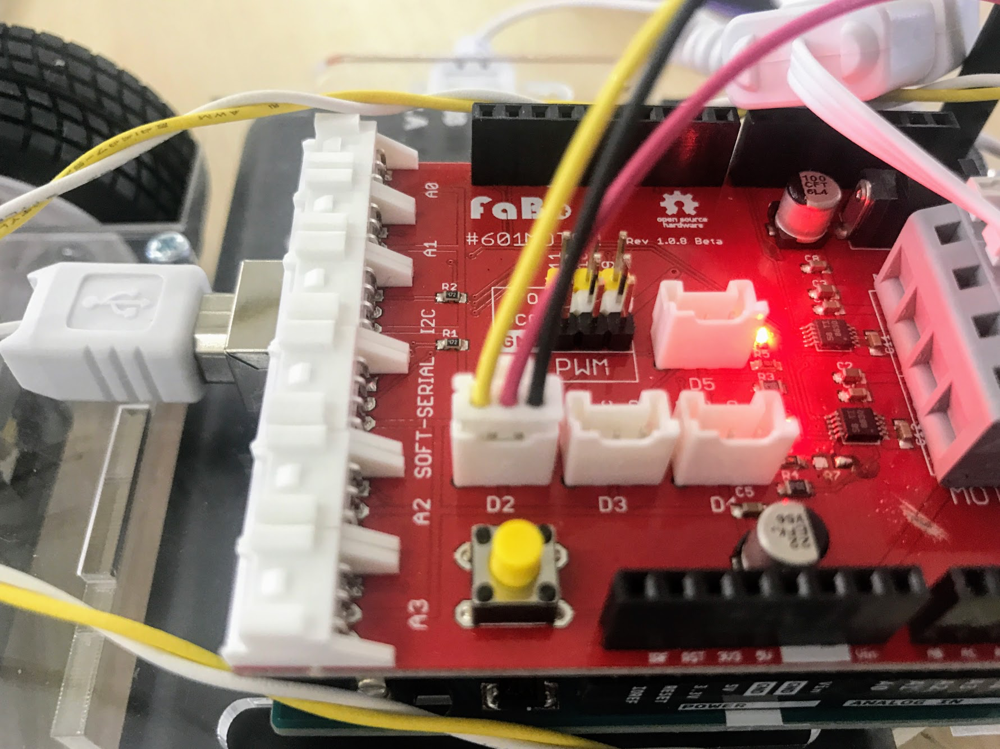
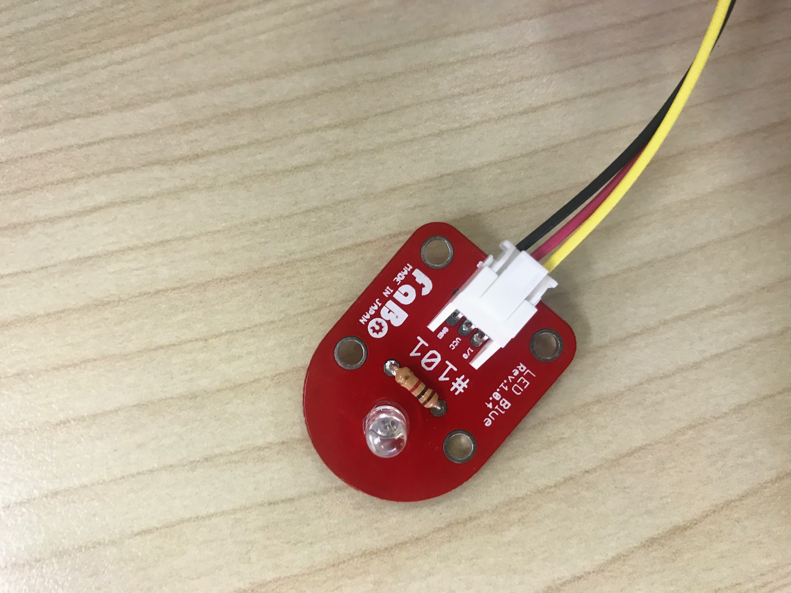
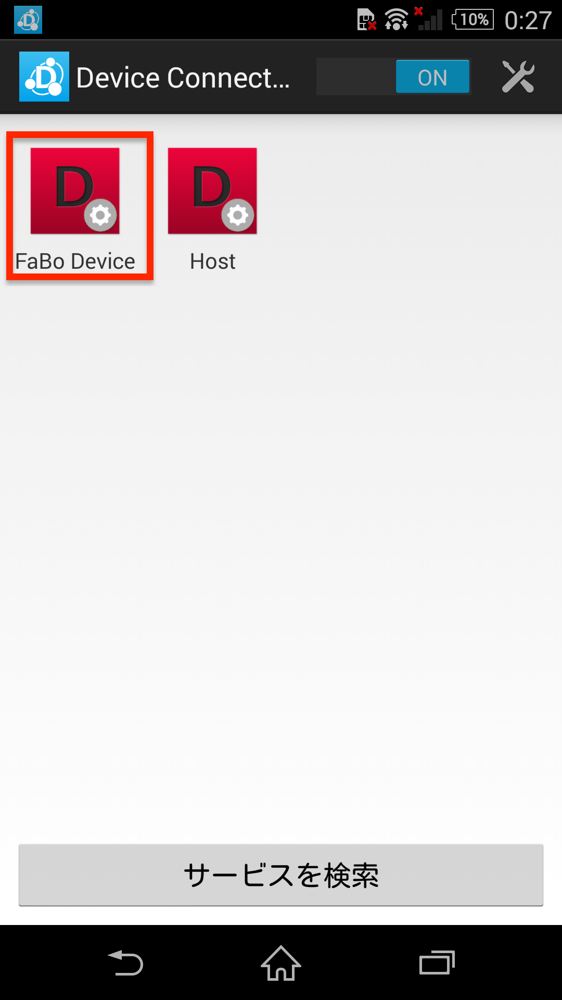
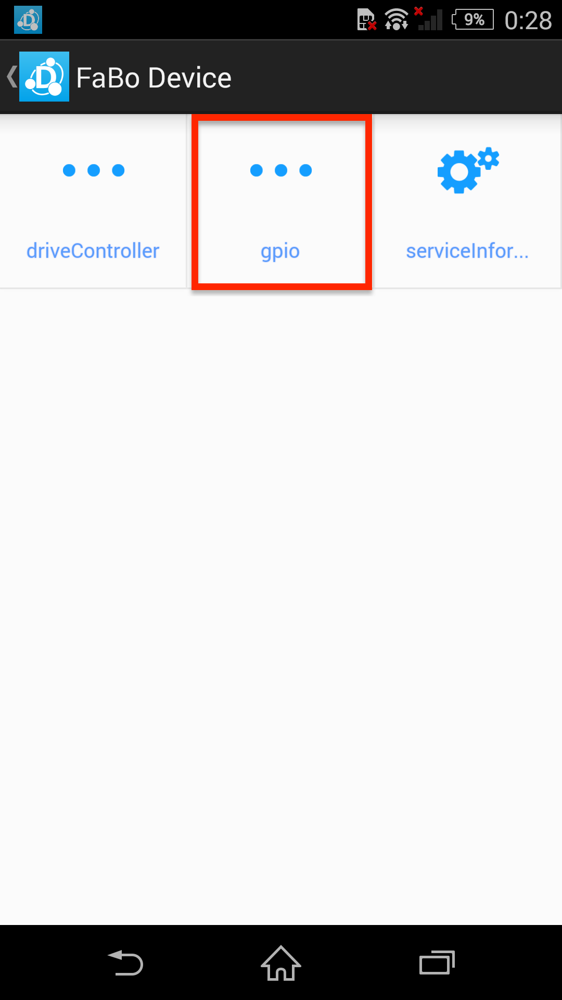
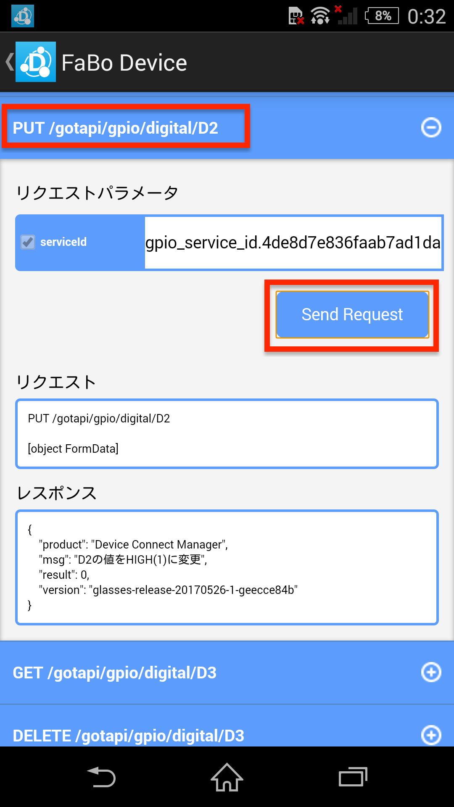
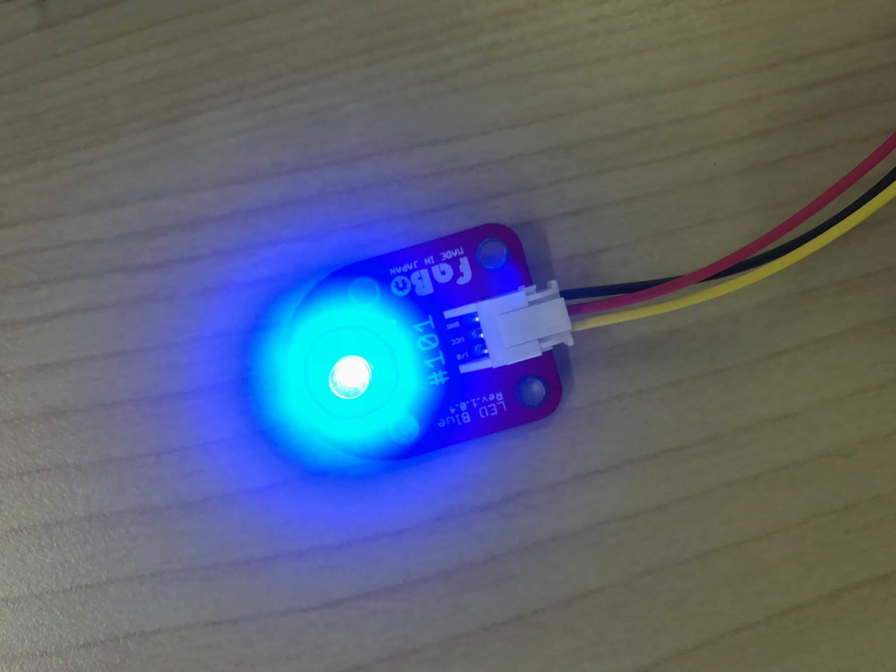
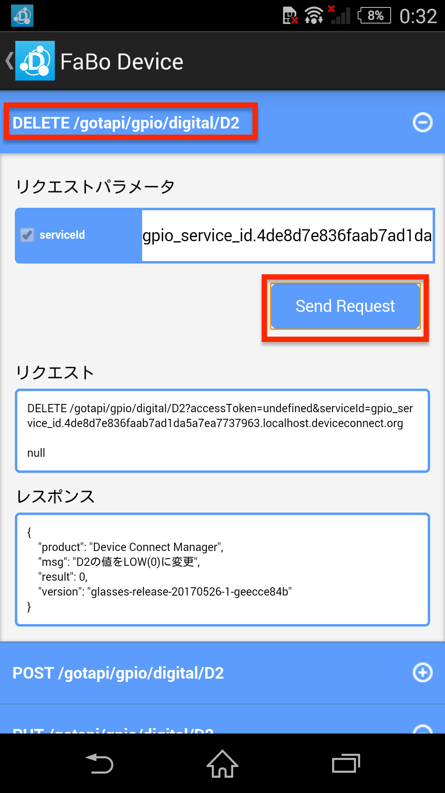
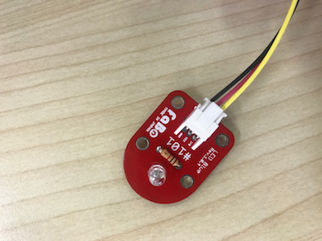

# 5.1 FaBo Pluginの設定

## 動作確認

FaBoのLED Brickを以下の写真のようにD2に接続します。
初期状態ではLEDは消えています。

PUT /gotapi/gpio/digital/D2を選択し、Send Requestをタップします。

すると以下の写真のようにLEDが点灯します。

次にDELETE /gotapi/gpio/digital/D2を選択し、Send Requestをタップします。

すると今度は以下の写真のようにLEDが消灯します。

