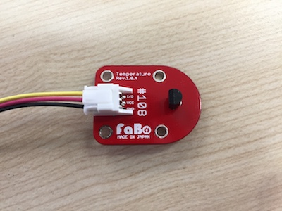
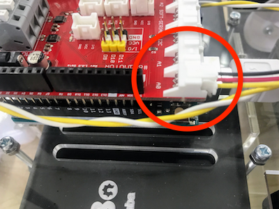

# 5.5 温度を取得

温度センサーをA0のPINに差し込みます。





## 温度を取得

HTML/JavaScriptのサンプルは`/sample/gpio_temperature/`フォルダに置かれています。
temperature.htmlをChrome Browserにドラッグ&ドロップし、実行します。

temperature.html

```html
<html>
    <head>
        <meta http-equiv="Content-Type" content="text/html;charset=UTF-8">
        <title>temperature</title>
        <script src="../lib/dconnectsdk-2.2.0.js" type="text/javascript"></script>
        <script src="../lib/setting.js" type="text/javascript"></script>
        <script src="temperature.js" type="text/javascript"></script>
    </head>
    <body>
        <input type="button" value="温度を取得" onclick="temperature();"/><br />
        <div id="value"></div>
    </body>
</html>

```

temperature.js

```javascript
function arduino_map(x, in_min, in_max, out_min, out_max){
    return (x - in_min) * (out_max - out_min) / (in_max - in_min) + out_min;
}

function temperature() {
    var valueElement = document.getElementById("value");
    var uri = "http://" + ip + ":" + port + "/gotapi/gpio/analog/A0?serviceId=" + faboId;
    console.log(uri);
    dConnect.get(uri, null, function(json) {
        console.log(json);
        if (json.result == 0) {
            var value = json.value;
            console.log(value);
            volt = arduino_map(value, 0, 1023, 0, 5000);
            temperatureValue = arduino_map(volt, 300, 1600, -30, 100);
            temperatureValue = Math.round(temperatureValue*10)/10;
            valueElement.innerHTML = "<h1>" + temperatureValue + "</h1>";
        }
    }, function(errorCode, errorMessage) {
        console.log(errorMessage);
    });
}

```
