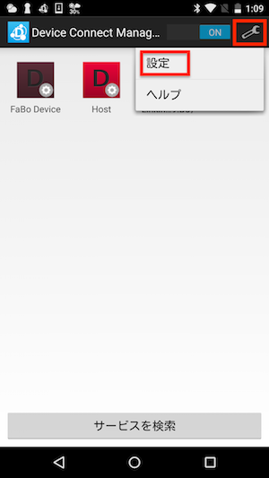
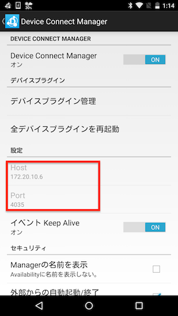
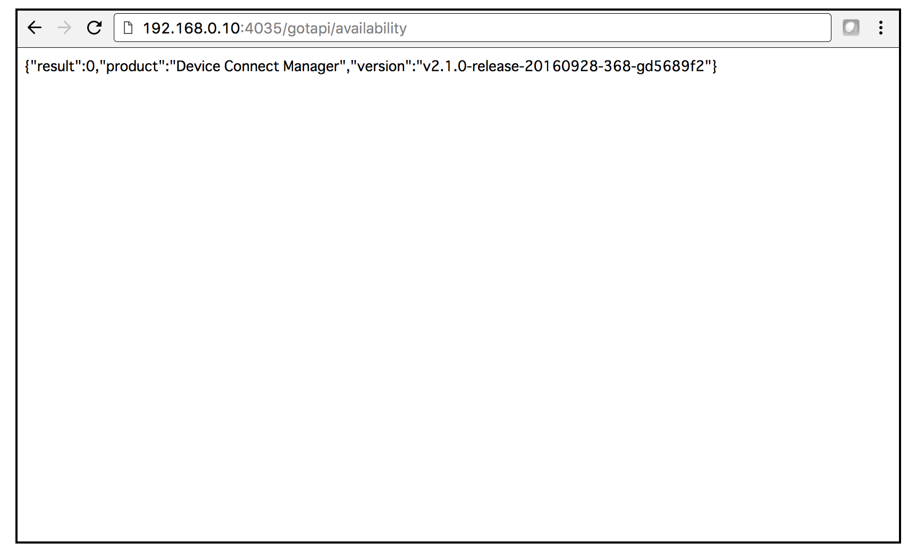
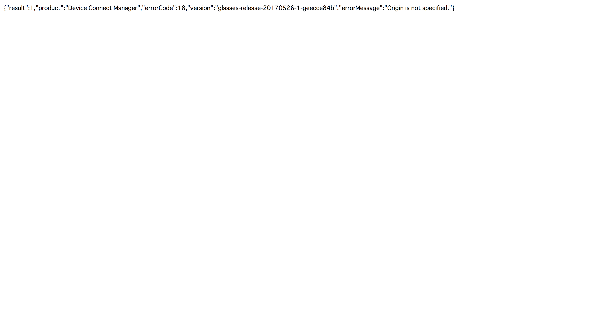

# 2.2 DeviceWebAPI Managerの生存確認

## IPアドレスの確認

設定>設定の項目のHostとPort番号をメモしておきます。

## DeviceWebAPI Managerの生存確認

DeviceWebAPI Managerの生存確認は、Checkツールを用いておこないます。

http://tool.fabo.io/devicewebapi/

### 接続ができた場合

### どこか設定が間違っている場合

