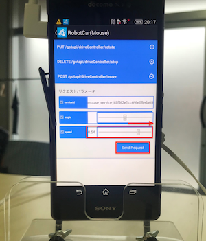

# 4.1 Robot Carへの接続

## DeviceWebAPI Managerの起動

DeviceWebAPI Managerを起動します。

FaBo Device, Robo...ouse)のアイコンが非アクティブ状態で表示されているのを確認します。

## Robot Carへの接続

Robot Carから出ているUSBケーブルをスマートフォンに差し込みます。

USBケーブルを差し込むと下記画面が表示されるので、赤丸の箇所をチェックし、OKを押します。

画面が切り替わり、認識と接続が始まります。(2-3秒程度)

FaBo Device, Robo...ouse)のアイコンがアクティブ状態で表示されれば認識成功です!

## スマートフォンをRobotCarにマウント

スマートフォンをRobot Carにマウントします。

## 動作確認

Robo...ouse)のアイコンを選択します。

driveControllerのアイコンを選択します。

ロボットカーを動作させるには、POST /gotapi/driveController/move の項目を選択し、speedを0.50以上にし、Send Requestを押します。

ロボットカーを停止させるには、DELETE /gotapi/driveController/stop の項目を選択し、Send Requestを押します。

