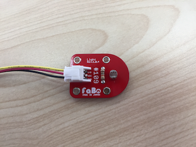
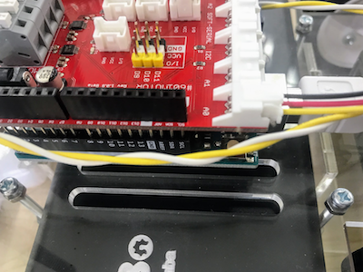

# 5.6 照度を取得

照度センサーをA0のピンに差し込みます。




##照度を取得
light.html
```html
<html>
  <head>
    <title>light</title>
    <script src="../lib/dconnectsdk-2.2.0.js" type="text/javascript"></script>
    <script src="light.js" type="text/javascript"></script>
    <script src="../lib/setting.js" type="text/javascript"></script>
  </head>
  <body>
        <input type="button" value="照度を取得" onclick="light();"/><br />
        <div id="value"></div>
  </body>
</html>
```
light.js
```javascript
function arduino_map(x, in_min, in_max, out_min, out_max){
    return (x - in_min) * (out_max - out_min) / (in_max - in_min) + out_min
}

function light() {
    var valueElement = document.getElementById("value");
    var uri = "http://" + ip + ":" + port + "/gotapi/gpio/analog/A0?serviceId=" + faboId;
    console.log(uri);
    dConnect.get(uri, null, function(json) {
        console.log(json);
        if (json.result == 0) {
            var value = json.value;
            console.log(value);
            valueElement.innerHTML = "<h1>" + value + "</h1>";
        }
    }, function(errorCode, errorMessage) {
        console.log(errorMessage);
    });
}
```
