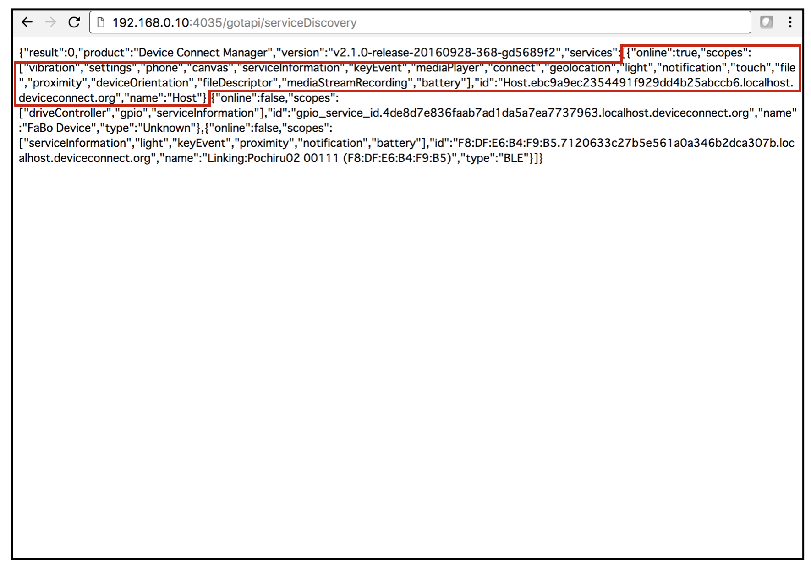

# HostのServiceIdの取得

## SeviceIdの取得

DeviceWebAPI Managerでは、対象とするプラグインにアクセスするために、ServiceIdを用います。

ServiceDiscoveryで対象プラグインのServiceIdを取得します。




```javascript
192.168.0.10:4035/gotapi/serviceDiscovery
```

> {"online":true,"scopes":["vibration","settings","phone","canvas","serviceInformation","keyEvent","mediaPlayer","connect","geolocation","light","notification","touch","file","proximity","deviceOrientation","fileDescriptor","mediaStreamRecording","battery"],"id":"Host.ebc9a9ec2354491f929dd4b25abccb6.localhost.deviceconnect.org","name":"Host"}

の箇所に記載されているServiceIdをコピーします。ServiceIdは、"id":の項目になります。

> "id":"Host.ebc9a9ec2354491f929dd4b25abccb6.localhost.deviceconnect.org"

これ以後のHost Pluginの操作は、上記IDを用います。
