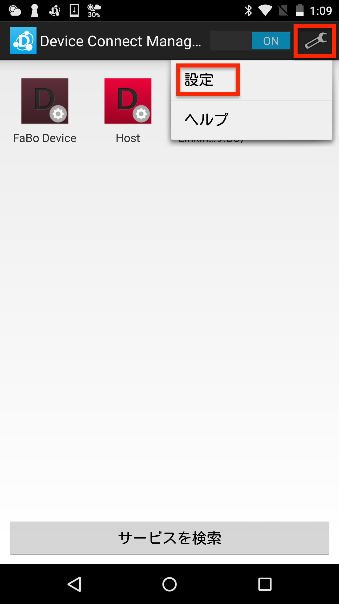
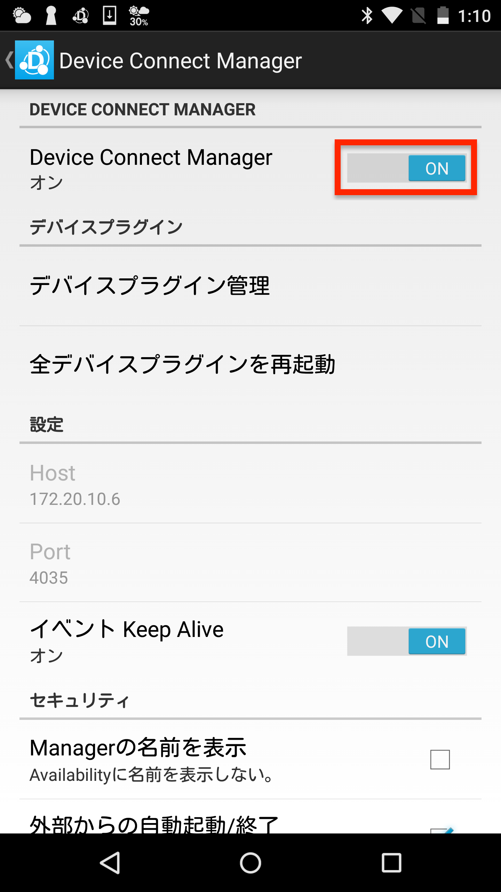
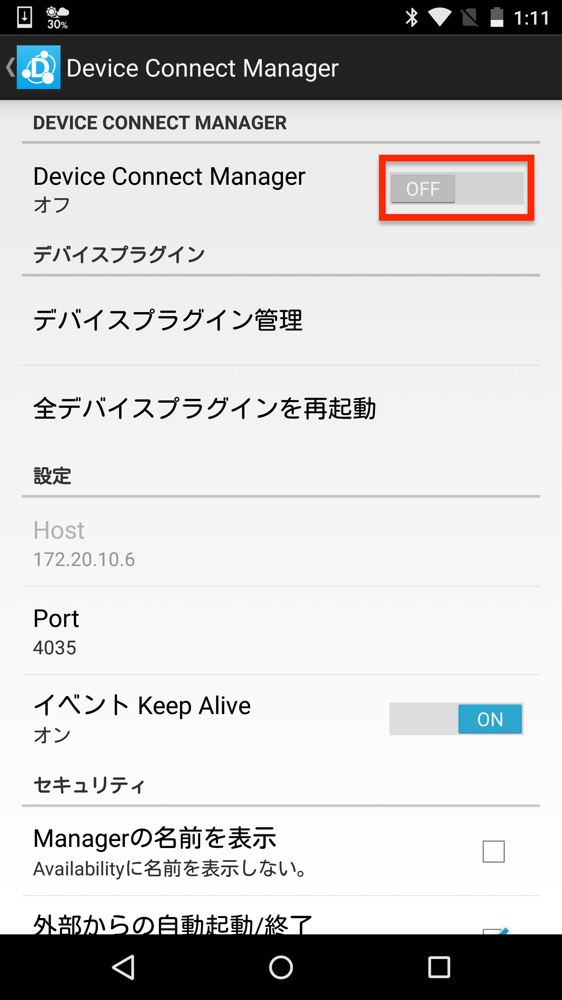
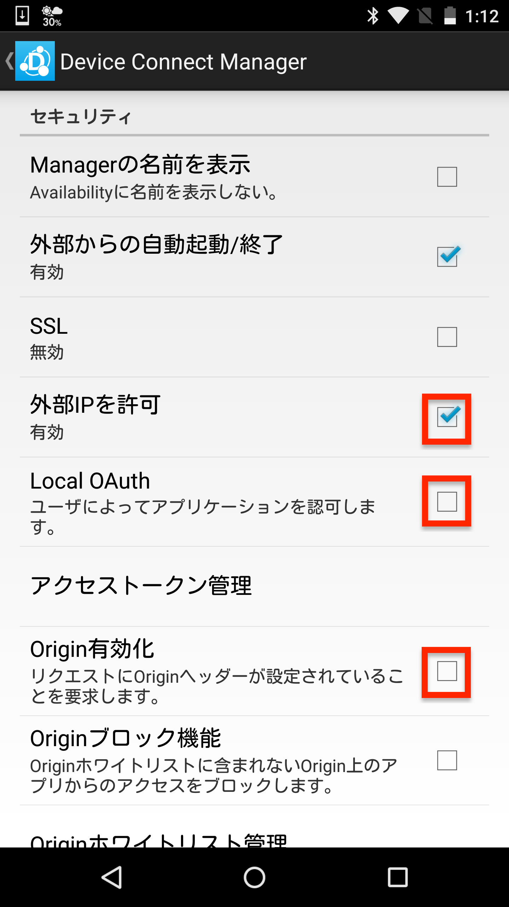
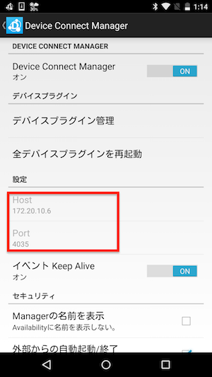
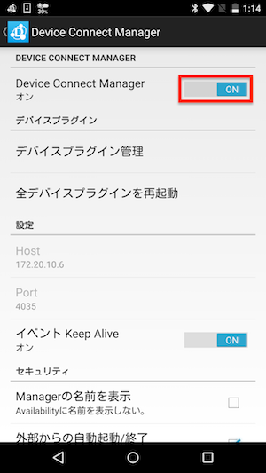

# DeviceWebAPI Managerの設定

DeviceWebAPI Managerを起動します。

設定を選択します。

これから設定の変更の処理をするため、一旦、DeviceWebAPI Managerをオフにします。

赤線で囲まれたチェックボックスを以下のように変更します。

|項目|処理|
|:--|:--|
| 外部IPを許可 | 選択する |
| Local OAuth | 選択をはずす|
| Originの有効化 | 選択をはずす|

設定の変更が完了したら、DeviceWebAPI Managerを再びオンにします。

