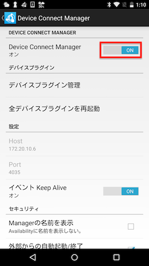
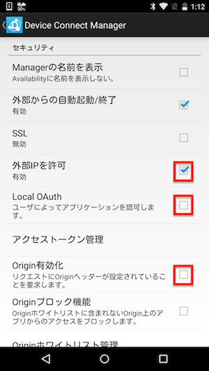
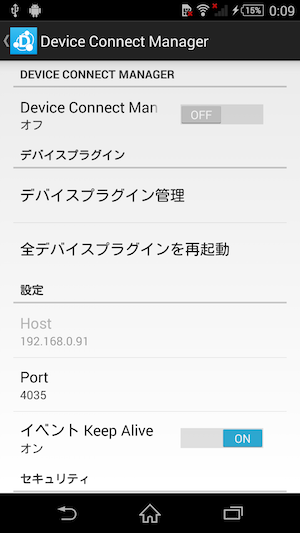

# DeviceWebAPI Managerの設定

設定を変更するためにDevice Connect Managerをオフにします。

赤線で囲まれたチェックボックスを以下のように変更します。

Device Connect ManagerがオンになっているとPortが変更できません。
変更する場合はDevice Connect Managerをオフにします。

最後にDevice Connect Managerをオンにします。

