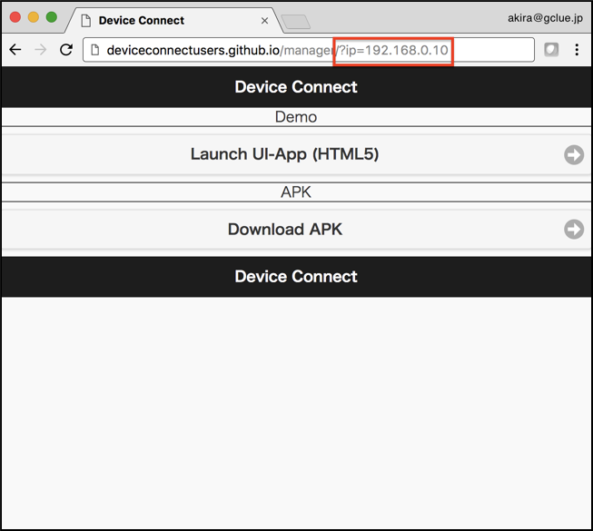
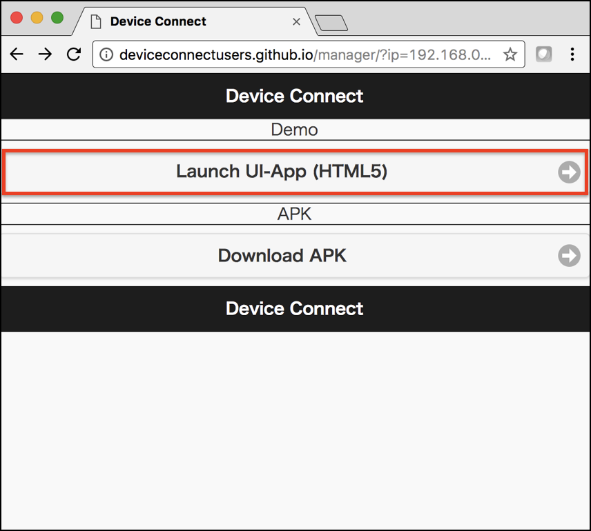

# 既成のサンプルApp

[http://deviceconnectusers.github.io/manager/](http://deviceconnectusers.github.io/manager/)に既成のAppがあります。

URLの一番最後に、DeviceWebAPI ManagerのIPアドレスを追記し、読み込みます。

今回は，アプリの例として，スマートフォンに搭載されているライトを点灯させるアプリを起動させてみる．

## スマートフォンのライトを点灯させる
スマートフォンに搭載されているライトを点灯させるアプリです．

トップ画面のLaunch UI-App(HTML5)をクリック．

次に，Search Devicesをクリック．

そして，Hostをクリックする．

アプリ一覧が表示されるので，今回はスマートフォンのライトを点灯させる light を選択．

このような画面が出て来るので，実際に点灯させる．
点灯させるためには，下の On ボタンを押すことで，スマートフォンのライトが点灯する．

#### 点灯させた際の例

また，ライトを消灯するためには，On のボタンの下にあるOff ボタンでライトを消灯できる． スライダなどをいじることによって，光量や色を変更することも可能．
